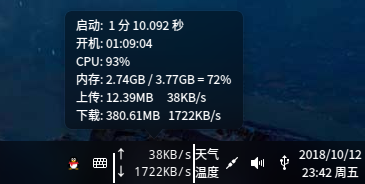

# CMDU_DDE_DOCK
Deep Linux system speed taskbar plugin, mouse hover shows boot time, CPU usage, memory usage, download bytes, upload bytes.

Installation: Terminal ./install.sh
Uninstall: Terminal ./uninstall.sh